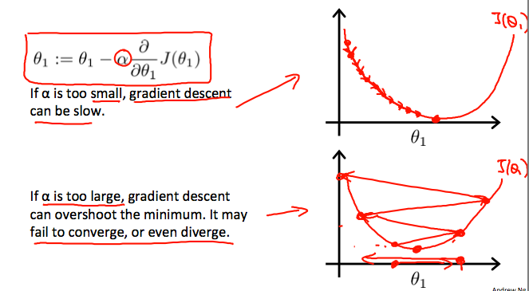

[machine-learning-Andrew-Ng](https://www.coursera.org/learn/machine-learning)

**该markdown文件需要支持latex才能正常解析公式**

# 什么是机器学习？
关于机器学习，有两个定义。Arthur Samuel将其描述为： "赋予计算机学习能力的研究领域，无需显式编程即可学习。" 这是一个比较老的、非正式的定义。

Tom Mitchell提供了一个更现代的定义。"如果一个计算机程序在T中的某类任务T和性能衡量标准P方面的表现随着经验E的提高而提高，那么就可以说它是从经验E中学习的。"

例如：下跳棋。
E=下过很多局跳棋的经验。
T=下跳棋的任务。
P=程序下一局赢的概率。

一般来说，任何机器学习问题都可以归入两大分类中的一种。
监督学习(supervised learning)和无监督学习(unsupervised learning)。

例子1:
假设你的电子邮件程序会观察你做或不做垃圾邮件标记，并在此基础上学习如何更好地过滤垃圾邮件。
将邮件分类为垃圾邮件或不垃圾邮件。(T)
看着你将邮件标记为垃圾邮件或不是垃圾邮件。(E)
正确分类为垃圾邮件/非垃圾邮件的邮件数量（或部分）。(P)

# 有督导学习(Supervised Learning)
在有监督学习中，我们得到一个数据集，已经知道我们的正确输出应该是什么样子的，有了输入和输出之间的关系的想法。

监督学习问题分为 "回归(regression)"问题和 "分类(classification)"问题。
在回归问题中，我们试图在连续输出中预测结果，也就是说，我们试图将输入变量映射到一些连续函数中。
而在分类问题中，我们试图在离散输出(0或1)中预测结果。换句话说，我们试图将输入变量映射到离散类别中。

例子1:
给出房地产市场上的房屋面积的数据，尝试预测其价格。价格作为面积的函数是一个连续输出，所以这是一个回归问题。

我们可以把这个例子变成一个分类问题，把我们的输出改为关于房子 "卖出的价格是高于还是低于要价"。在这里，我们将根据价格将房屋分为两个离散的类别。

例子2:
(a) 回归--给定一个人的照片，我们必须根据给定的照片来预测他的年龄。
(b) 分类----鉴于一个肿瘤患者，我们必须预测肿瘤是恶性还是良性。

例子3:
你正在经营一家公司，你想开发学习算法来分别解决两个问题。
问题1:你有大量相同商品的库存。你想预测未来3个月内这些商品有多少会卖出。
问题2：你想让软件检查单个客户的账户，并对每个账户判断是否被黑客入侵/入侵。
将问题1作为回归问题，问题2作为分类问题。

# 无监督学习(unsupervised learning)
无监督学习允许我们在几乎不知道我们的结果应该是什么样子的情况下处理问题。
我们可以从数据中推导出结构，我们不一定知道变量的效果。

我们可以根据数据中的变量之间的关系对数据进行聚类，从而推导出这种结构。

在无监督学习中，没有基于预测结果的反馈。

例子1:
聚类。拿一个由100万个不同基因组成的集合，找到一种方法，将这些基因自动归类为一组，这些基因通过不同的变量，如寿命、位置、角色等，以某种方式相似或相关。

非聚类。["鸡尾酒会算法"](https://en.wikipedia.org/wiki/Cocktail_party_effect)，
(让你在混沌的环境中找到结构。即从鸡尾酒会上的网状声音中识别出单个声音和音乐)。

例子2:
给定一个在网络上找到的一组新闻文章，将其分组成关于相同故事的文章集。
给定一个客户数据的数据库，自动发现市场细分，并将客户分成不同的市场细分。

# 模型表示(model)
为了建立供将来使用的符号，
我们将使用 $x^{(i)}$表示“输入”变量（在此示例中为居住区域），也称为输入要素，
并且 $y^{(i)}$和表示我们试图预测的“输出”或目标变量（价格）。
一对 
$$
(x^{(i)},y^{(i)})
$$ 
被称为训练示例，
而我们将用来学习的数据集: 
m个训练示例的列表
$$
(x^{(i)},y^{(i)})
$$ 

$i=1,...,m$ 被称为训练集(训练样本的数量)。
注意，符号中的上标“(i)”只是训练集中的一个索引，与幂运算无关。
我们还将使用X表示输入值的空间，并使用Y表示输出值的空间。在此示例中，$X = Y =ℝ$。

为了更正式地描述监督学习问题，我们的目标是给定训练集(training set)，学习一个函数$h：X→Y$，以便$h(x)$是对应y值的“良好”预测因子。
由于历史原因，此函数h称为假设(hypothesis)。
从图片上可以看到，因此过程是这样的：

hypothesis: 
$$
h_θ(x)=θ_0+θ_1x
$$

当我们要预测的目标变量是连续的时，
例如在住房示例中，我们将学习问题称为回归问题。
当y只能采用少量离散值时（例如，假设给定居住面积，我们想预测某个住宅是房子还是公寓），我们称其为分类问题。

**回归里还有分一次线性回归拟合、二次线性回归拟合.**

# 代价函数(cost function)

我们可以使用代价函数来衡量假设函数(hypothesis function)的准确性。
这将假设的所有结果与x的输入和实际输出y的平均值进行平均差（实际上是平均值的奇特形式）。

把它拆开，$\frac{1}{2}\overline{x}$里的$\overline{x}$是$h_θ(x_i)-y_i$的二次方的平均值，或预测值与实际值之间的差额。
  
此函数称为 平方差函数(平方差代价函数),最常用的代价函数.
$(\frac{1}{2})$均值减半为方便计算梯度下降,因为平方函数的导数项将抵消$\frac{1}{2}$术语。

除以m是使得误差平均到每个样本，除以2是一个微积分技巧，用于消除计算偏导数时出现的2。

图中$θ_0$ 和 $θ_1$ 两个参数分别代表了
0.5 和1,
$θ_0$为初始的y轴值,$θ_1$为x轴增长1后的y轴增长的值(斜率).

假设我们有一个有m=3个例子的训练集，如下图所示。我们的假设表示方式为$h_θ(x)=θ_1x$,带参数$θ_1$,代价函数是$J(θ_1)$ 也就是
$$
J(θ_1)=\frac{1}{2m}\sum_{i=1}^{m} {(h_θ(x^{(i)})-y^{(i)})^2} 
$$

图中三点为$(1,1)(2,2)(3,3)$,当$θ_1$为0时,计算
$$
J(0)=\frac{1}{2\times3}\sum_{i=1}^{3} {(0(x^{(i)})-y^{(i)})^2} 
$$
也就是$((-1^2)+(-2^2)+(-3^2))\div6$,
所以$J(0)$的结果为$\frac{14}{6}$.

如果我们试着用直观的方式来思考，我们的训练数据集是散布在x-y平面上的。我们尝试着做一条直线(定义为：$h_θ(x)$)通过这些分散的数据点。

我们的目标是得到一条可能的最佳线。
最好的线将是这样的，这样散点与线的平均平方垂直距离最小。
理想情况下，该线应该穿过我们训练数据集的所有点。在这种情况下，$J(θ_0,θ_1)$的值将为0，
下面的例子显示了理想的情况，我们的成本函数为0。

  
当$θ_1 = 1$时，我们得到一个斜率为1的斜率，它贯穿了我们模型中的每一个数据点。相反，当$θ_1 = 0.5$时，我们看到从我们的拟合到数据点的垂直距离增加。

这使我们的成本函数增加到0.58。将其他几个点绘制成下图。

因此，作为目标，我们应该努力使代价函数最小化。
在这种情况下，$θ_1 = 1$是我们的全局最小值。

等高线图是由许多等高线组成的图形。一个双变量函数的等值线在同一条线上的所有点上都有一个常数。
下面右边的图形就是这样的一个例子。

取任何一种颜色，沿着 "圆 "走，人们会期望得到相同的成本函数的值。
例如，在上面的绿线上找到的三个绿色点的值都是相同的$J(θ_0，θ_1)$因此，它们沿着同一条线被发现。
圈出的x显示了左边图中的成本函数的值，当$θ_0= 800$，且$θ_1= -0.15$. 取另一个$h(x)$并绘制其等高线图，可以得到以下图形。

当$θ_0= 360$和 $θ_1= 0$，则$J(θ_0,θ_1)$的值为0。在等高线图中越来越接近中心，从而减少了成本函数的误差。现在给我们的假设函数一个略带正的斜率，可以使数据的拟合度更好。

上图是尽可能地使成本函数最小化，因此，结果为$θ_1$和$θ_0$倾向于分别为0.12和250左右。
在我们的图形上把这些值画在右边，似乎是把我们的点放在最内侧的 "圆 "的中心。

# 梯度下降算法(Gradient Descent)
所以我们有了我们的假设函数(hypothesis function)，我们有了衡量它与数据匹配度的方法。现在，我们需要估计假设函数中的参数。这就是梯度下降的地方。

设想一下，我们把我们的假设函数基于其域$θ_0$和$θ_1$（实际上，我们是把代价函数作为参数估计的函数绘制成图）。我们绘制的不是$x$和$y$本身，而是我们的假设函数的参数范围和选择特定参数集所产生的代价。

我们将$θ_0$放在$x$轴上，$θ_1$放在$y$轴上，代价函数在$z$轴的垂直方向上。我们的图上的点将是使用我们的假说与这些特定的$θ$参数的代价函数的结果。下图就是这样的设置。

当我们的代价函数在图中的坑的最底部，也就是它的值为最小值时，我们就知道我们已经成功了。红色箭头表示图中的最小点。

我们这样做的方法是取我们的代价函数的导数（函数的切线）。切线的斜率就是该点的导数，它将为我们提供一个前进的方向。我们在代价函数上沿着斜率最陡的方向向下做阶梯。每一步的大小是由参数$α$决定的，这个参数叫做学习率(learning rate)。

例如，上图中的每个 "星 "之间的距离是由我们的参数$α$决定的步长，$α$越小，步长越小，$α$越大，步长越大。步距的方向由$J(θ_0,θ_1)$的部分导数决定。根据图形上的起始点的不同，可能会有不同的终点。上面的图片向我们展示了两个不同的出发点，最终在两个不同的地方。

梯度下降算法是:
重复，直到收敛:
$$
θ_j:=θ_j-α\frac {∂} {∂θ_j}J(θ_0,θ_1)
$$
其中$j=0，1$代表特征索引号。$J$代表的是代价函数.

在每次迭代$j$时，应该同时更新参数$θ_1，θ_2，...，θ_n$。在计算另一个参数之前更新一个特定的参数，然后再在$j^{(th)}$上计算另一个参数,迭代会产生错误的实现。

假设 $θ_0= 1$, $θ_1= 2$,而我们下面的公式同时更新 $θ_0$和$θ_1$,
(for $j=0$ and $j=1$)
$$
θ_j:=θ_j+\sqrt{θ_0θ_1}
$$
那么$θ_0和θ_1$的结果值是多少?
当$j=0$时,
$$
θ_0:=θ_0+\sqrt{θ_0θ_1}
$$
$$
θ_0=1+\sqrt{2}
$$
当$j=1$时,因为是同步更新,所以$θ_0$还是原来的值
$$
θ_1:=θ_1+\sqrt{θ_0θ_1}
$$
$$
θ_1=2+\sqrt{2}
$$

## 梯度下降直觉(Gradient Descent Intuition)
我们探讨了使用一个参数θ_1来实现梯度下降的场景，并绘制出其代价函数。
我们对单一参数的计算公式为:
重复直到收敛:
$$
θ_1:=θ_1-α\frac {d} {dθ_1}J(θ_1)
$$

无论斜率对$\frac {d} {dθ_1}J(θ_1)$的符号如何，$θ_1$最终都会收敛到最小值。下图显示，当斜率为负时，$θ_1$的值增加，当斜率为正时，$θ_1$的值减少。

从另一个侧面说明，我们应该调整我们的参数$α$，以确保梯度下降算法在合理的时间内收敛。如果不能收敛或者太长的时间无法得到最小值，意味着我们的步长是错误的。

梯度下降是如何在固定步长$α$的情况下收敛的？

收敛背后的直觉(intuition)是，当我们接近凸函数的底部时，$\frac {d} {dθ_1}J(θ_1)$会接近0。在最小值时，导数将永远是0，因此我们得到:
$$
θ_1:=θ_1-α\times0
$$

假设$θ_1$处于局部最优值$J(θ_1)$，如图所示。
一阶梯度下降
$$
θ_1:=θ_1-α\frac {d} {dθ_1}J(θ_1)
$$
会做什么？ -- 保持$θ_1$不变

## 线性回归的梯度下降

