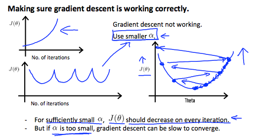

# 代码环境部署
## MATLAB Online
[创建MathWorks帐户](https://www.mathworks.com/mwaccount/register)

[增加MATLAB Online许可证](https://www.mathworks.com/licensecenter/classroom/machine_learning/)

[MATLAB Online](https://matlab.mathworks.com/)

[matlab文档](https://ww2.mathworks.cn/help/matlab/)

## Octave
[安装](http://www.gnu.org/software/octave/)

[octave文档](https://octave.org/doc/v5.2.0/)

# 多变量线性回归
## 多种特征(功能)(feature)
带多变量的线性回归也被称为 "多变量线性回归"。

现在我们介绍一下方程的记法，在这里我们可以有任意数量的输入变量。

$$
x^{(i)}_j = 第i个训练实例中的特征j的值
$$

$$
x^{(i)} = 第i个训练实例的输入（特征）。
$$

$$
m = 训练实例数
$$

$$
n = 特征(功能)数
$$

适应这些多重特征的多变量假设函数形式如下：
$$
h_θ(x) = 
θ_0+θ_1x_1+θ_2x_2+θ_3x_3+⋯+θ_nx_n
$$

为了形成对这个函数的直观认识，我们可以把$θ_0$看作是房屋的基本价格，$θ_1$是每平方米的价格，$θ_2$是每层的价格，以此类推，$x_1$为房屋的平方米数，$x_2$为楼层数，等等。

利用矩阵乘法的定义，我们的多变量假设函数可以简明地表示为。

$$
h_θ(x) =
\begin{bmatrix} 
θ_0&θ_1&...&θ_n
\end{bmatrix}
\begin{bmatrix} 
x_0
\\ 
x_1
\\ 
...
\\ 
x_n
\end{bmatrix}
=θ^Tx
$$

这是我们对一个训练实例的假设函数的向量化。

假设$x_{0}^{(i)}  =1 \ for (i∈1,…,m)$
这样，我们就可以用`θ`和`x`进行矩阵运算。因此，使两个向量'`θ`'和'`x`'在元素上相互匹配（即元素数相同：`n+1`）。

## 多变量的梯度下降

$$
J(θ)=\frac {1} {2m} \sum_{i=1}^{m} {(h(θ)x^{(i)}-y^{(i)})^2}
$$
等效
$$
J(θ)=\frac {1} {2m} \sum_{i=1}^{m} {(θ^Tx^{(i)}-y^{(i)})^2}
$$
等效
$$
J(θ)=\frac {1} {2m} \sum_{i=1}^{m} {\left(\left(\sum_{j=0}^{n}{θ_jx_j^{(i)}}\right)-y^{(i)}\right)^2}
$$
(Inner  sum  starts  at  0)

梯度下降方程本身一般都是相同的形式，我们只需要对我们的`'n'`个特征进行重复。

重复直到收敛:
{
$$
θ_0:=θ_0-α\frac {1} {m} \sum_{i=1}^{m} {(h(θ)x^{(i)}-y^{(i)})\times{x_0^{(i)}}}
\\
θ_1:=θ_1-α\frac {1} {m} \sum_{i=1}^{m} {(h(θ)x^{(i)}-y^{(i)})\times{x_1^{(i)}}}
\\
θ_2:=θ_2-α\frac {1} {m} \sum_{i=1}^{m} {(h(θ)x^{(i)}-y^{(i)})\times{x_2^{(i)}}}
\\
......
$$
}

换句话说。
重复直到收敛:

$$
θ_j:=θ_j-α\frac {1} {m} \sum_{i=1}^{m} {(h(θ)x^{(i)}-y^{(i)})\times{x_j^{(i)}}}
\\
for \ j:=0...n
$$
}

下图是一个变量的梯度下降与多变量的梯度下降的比较。

## 梯度下降实践1 - 特征缩放
我们可以通过让每个输入值都处于大致相同的范围内来加速梯度下降。这是因为`θ`在小范围内下降速度快，而在大范围内下降速度慢，所以当变量非常不均匀时，`θ`会低效率地振荡下降到最佳值。

防止这种情况的方法是修改输入变量的范围，使它们都大致相同。

最理想的情况是：
$$
−1 ≤ x_{(i)}  ≤  1
$$
或
$$
−0.5 ≤ x_{(i)}  ≤  0.5
$$

这些都不是确切的要求，我们只是想加快速度。我们的目标是将所有的输入变量大致归入其中的一个范围内，给或取几个。

有两种技术可以帮助解决这个问题：特征缩放( feature scaling)和均值归一化(mean normalization)。
* 特征缩放涉及到将输入值除以输入变量的范围(即最大值减去最小值)，从而得到一个新的范围为1。 
* 平均归一化涉及到将输入变量的平均值从输入变量的值中减去，从而得到一个新的输入变量的平均值为0。

要实现这两种技术，请按照这个公式调整输入值。
$$
x_i := \frac{x_i − μ_i}{s_i} 
$$

其中$μ_i$是特征$(i)$的所有值的平均值，$s_i$是值的范围$(max-min)$(最大值 - 最小值)，或$s_i$是标准差。

注意，除以范围或除以标准差，会得到不同的结果。

例如，
如果$x_i$代表100到2000之间的房价，均值为1000，那么，
$$
x_i :=\frac{price - 1000}{2000 - 100}
$$

## 梯度下降实践2 -- 学习率
**调试梯度下降(Debugging gradient descent)**。在$x$轴上画出迭代次数的图。现在将成本函数$J(θ)$与梯度下降的迭代次数作图。如果 $J(θ)$ 不断增加，那么你可能需要减少 $α$。

自动收敛测试(Automatic convergence test)。如果$J(θ)$在一次迭代中下降的幅度小于$E$，则宣布收敛，其中$E$是一些小值，如$10^{-3}$。然而在实际操作中，这个阈值的选择是很难的。

实践证明，如果学习率$α$足够小，那么$J(θ)$在每一次迭代中都会减少。

总结一下：

如果α太小：收敛缓慢。

如果α太大，则收敛速度慢。可能在每次迭代时都不会减少，因此可能不会收敛。

## 特征和多项式回归
我们可以通过几种不同的方式改进我们的特征和假设函数的形式。

我们可以将多个特征组合成一个。
例如，我们可以将$x_1$和$x_2$合并成一个新的特征$x_3$，即$x_1\times{x_2}$

**多项式回归**
如果我们的假设函数不能很好地拟合数据，我们的假设函数不需要是线性的（一条直线）。

我们可以改变我们的假设函数的行为或曲线，使其成为二次函数、三次函数或平方根函数（或任何其他形式）。

例如，如果我们的假设函数是
$$
h_θ(x) = θ_0 + θ_1x_1
$$
，那么我们可以根据$x_1$创建额外的特征，得到二次函数
$$
h_θ(x) = θ_0 + θ_1x_1 +θ_2x_1^2
$$
或三次函数
$$
h_θ(x) = θ_0 + θ_1x_1 + θ_2x_1^2 + θ_3x_1^3
$$	

在三次函数版本中，我们创建了新的特征$x_2$和$x_3$，其中$x_2=x_1^2$，$x_3=x_1^3$。

为了让它成为一个平方根函数，我们可以做:
$$
h_θ(x) = θ_0 + θ_1x_1 + θ_2\sqrt{x_1}
$$	

有一点很重要，如果你这样选择功能，那么功能缩放就变得非常重要。

例如：如果$x_1$的范围是$1-1000$，那么$x_1^2$的范围是$1-1000000$，$x_1^3$的范围是$1-1000000000$。
	
# 分析计算参数
## 正规方程(Normal Equation)
梯度下降法给出了最小化J的一种方法，让我们来讨论第二种方法，这次是明确地执行最小化，而不需要借助迭代算法。在 **正规方程**方法中，我们将通过明确地取其相对于$θj's$的导数并将其设为零来最小化$J$。这样，我们就可以在不迭代的情况下找到最优$θ$。
正规方程公式如下。
$$
θ=(X^T X)^{−1} \times X^Ty
$$

上图中,X的规模为$4 \times 5$,因为特征(n)需要$+1$;y的规模为$4 \times 1$;θ的规模为$5 \times 1$.

不需要用正规方程做特征缩放。

下面是梯度下降和正规方程的比较。

| 梯度下降            | 正规方程                         |
| ------------------- | -------------------------------- |
| 需要选择α(学习曲线) | 不需要选择α                      |
| 需要多次迭代        | 不需要迭代。                     |
| $O(kn^2)$           | $O(n^3)$，需要计算$X^TX$的倒数。 |
| 当n很大时，效果很好 | 如果n很大，则速度很慢。          |

对于普通方程，计算反演的复杂度为 $\mathcal{O}(n^3)$。所以如果我们有非常多的特征，正规方程会很慢。在实践中，当n超过10000时，可能是一个从普通解到迭代过程的好时机。

## 正规方程不可逆性
当在Octave中实现正规方程时，我们希望使用`'pinv'`函数而不是`'inv'`。即使$X^TX$不可逆，`'pinv'`函数也会给你一个$θ$的值。

如果$X^TX$是不可逆的，常见的原因可能是有:
* 冗余特征，即两个特征的关系非常密切（如它们是线性依赖）。
* 太多的特征（如$m≤n$）。在这种情况下，删除一些特征或使用 "正则化"(regularization)。

解决上述问题的方法包括删除一个与另一个线性依赖的特征，或者在特征过多时删除一个或多个特征。

