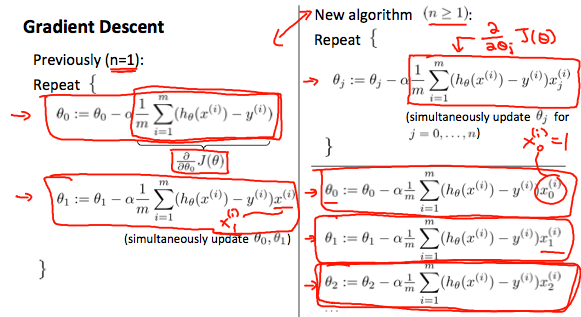

# 代码环境部署
## MATLAB Online
[创建MathWorks帐户](https://www.mathworks.com/mwaccount/register)

[增加MATLAB Online许可证](https://www.mathworks.com/licensecenter/classroom/machine_learning/)

[MATLAB Online](https://matlab.mathworks.com/)

[matlab文档](https://ww2.mathworks.cn/help/matlab/)

## Octave
[安装](http://www.gnu.org/software/octave/)

[octave文档](https://octave.org/doc/v5.2.0/)

# 多变量线性回归
## 多种特征(功能)(feature)
带多变量的线性回归也被称为 "多变量线性回归"。

现在我们介绍一下方程的记法，在这里我们可以有任意数量的输入变量。

$$
x^{(i)}_j = 第i个训练实例中的特征j的值
$$

$$
x^{(i)} = 第i个训练实例的输入（特征）。
$$

$$
m = 训练实例数
$$

$$
n = 特征(功能)数
$$

适应这些多重特征的多变量假设函数形式如下：
$$
h_θ(x) = 
θ_0+θ_1x_1+θ_2x_2+θ_3x_3+⋯+θ_nx_n
$$

为了形成对这个函数的直观认识，我们可以把$θ_0$看作是房屋的基本价格，$θ_1$是每平方米的价格，$θ_2$是每层的价格，以此类推，$x_1$为房屋的平方米数，$x_2$为楼层数，等等。

利用矩阵乘法的定义，我们的多变量假设函数可以简明地表示为。

$$
h_θ(x) =
\begin{bmatrix} 
θ_0&θ_1&...&θ_n
\end{bmatrix}
\begin{bmatrix} 
x_0
\\ 
x_1
\\ 
...
\\ 
x_n
\end{bmatrix}
=θ^Tx
$$

这是我们对一个训练实例的假设函数的向量化。

假设$x_{0}^{(i)}  =1 for (i∈1,…,m)$
这样，我们就可以用`θ`和`x`进行矩阵运算。因此，使两个向量'`θ`'和'`x`'在元素上相互匹配（即元素数相同：`n+1`）。

## 多变量的梯度下降

$$
J(θ)=\frac {1} {2m} \sum_{i=1}^{m} {(h(θ)x^{(i)}-y^{(i)})^2}
$$
等效
$$
J(θ)=\frac {1} {2m} \sum_{i=1}^{m} {(θ^Tx^{(i)}-y^{(i)})^2}
$$
等效
$$
J(θ)=\frac {1} {2m} \sum_{i=1}^{m} {\left(\left(\sum_{j=0}^{n}{θ_jx_j^{(i)}}\right)-y^{(i)}\right)^2}
$$
(Inner  sum  starts  at  0)

梯度下降方程本身一般都是相同的形式，我们只需要对我们的`'n'`个特征进行重复。

重复直到收敛:
{
$$
θ_0:=θ_0-α\frac {1} {m} \sum_{i=1}^{m} {(h(θ)x^{(i)}-y^{(i)})\times{x_0^{(i)}}}
\\
θ_1:=θ_1-α\frac {1} {m} \sum_{i=1}^{m} {(h(θ)x^{(i)}-y^{(i)})\times{x_1^{(i)}}}
\\
θ_2:=θ_2-α\frac {1} {m} \sum_{i=1}^{m} {(h(θ)x^{(i)}-y^{(i)})\times{x_2^{(i)}}}
\\
......
$$
}

换句话说。
重复直到收敛:

$$
θ_j:=θ_j-α\frac {1} {m} \sum_{i=1}^{m} {(h(θ)x^{(i)}-y^{(i)})\times{x_j^{(i)}}}
\\
for \ j:=0...n
$$
}

下图是一个变量的梯度下降与多变量的梯度下降的比较。

## 梯度下降实践1 - 特征缩放
我们可以通过让每个输入值都处于大致相同的范围内来加速梯度下降。这是因为`θ`在小范围内下降速度快，而在大范围内下降速度慢，所以当变量非常不均匀时，`θ`会低效率地振荡下降到最佳值。

防止这种情况的方法是修改输入变量的范围，使它们都大致相同。

最理想的情况是：
$$
−1 ≤ x_{(i)}  ≤  1
$$
或
$$
−0.5 ≤ x_{(i)}  ≤  0.5
$$

这些都不是确切的要求，我们只是想加快速度。我们的目标是将所有的输入变量大致归入其中的一个范围内，给或取几个。

有两种技术可以帮助解决这个问题：特征缩放( feature scaling)和均值归一化(mean normalization)。
* 特征缩放涉及到将输入值除以输入变量的范围(即最大值减去最小值)，从而得到一个新的范围为1。 
* 平均归一化涉及到将输入变量的平均值从输入变量的值中减去，从而得到一个新的输入变量的平均值为0。

要实现这两种技术，请按照这个公式调整输入值。
$$
x_i := \frac{x_i − μ_i}{s_i} 
$$

其中$μ_i$是特征$(i)$的所有值的平均值，$s_i$是值的范围$(max-min)$，或$s_i$是标准差。

注意，除以范围或除以标准差，会得到不同的结果。

例如，
如果$x_i$代表100到2000之间的房价，均值为1000，那么，
$$
x_i :=\frac{price - 1000}{1900}
$$

